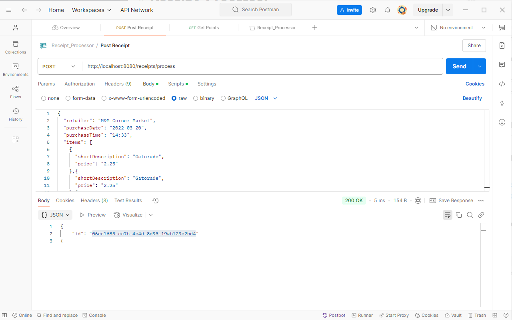

# Receipt_Processor
This is a RESTful API developed in Go which takes in receipts, generates IDs for each receipt and stores them in-memory, then calculates points based on a specific criteria for any given receipt.  

Endpoints included in this API are:
- /receipts/process
- /receipts/{id}/points

## Getting Started
### Prerequisites
- [Go](https://go.dev/doc/install) - The language used
- [oapi-codegen](https://github.com/oapi-codegen/oapi-codegen) - Optional - used to generate the server-side code for the API. See [api readme](api/README.md)

### Deploying
Run the project
```go run .```
From here you can send payloads using an API testing suite such as Postman

Or use a curl command
```
curl -X GET http://localhost:8080/receipts/{id}/points
```
Breakdown of API endpoints and how to hit them can be found in this [section](#-api-endpoint-breakdown)

### Running Tests
I've provided unit tests that test the functions within the ```app``` and ```handlers``` packages.
To run all tests 
```
go run ./...
```
To run a specific test, simply ```cd``` into the appropriate folder and ```go test```
```
cd /app
go test
```
You can also include the verbose tag ```-v``` to get a more detailed breakdown of the tests
```
go test -v
```
### API Endpoint Breakdown
#### Process Receipts
- Path: /receipts/process
- Method: POST
- Sample command:
```
curl -X POST -H "Accept: application/json" -H "Content-Type: application/json" -d '{"retailer": "M&M Corner Market", "purchaseDate": "2022-03-20", "purchaseTime": "14:33", "items":[{"shortDescription": "Gatorade", "price": "2.25"}, {"shortDescription": "Gatorade", "price": "2.25"}, {"shortDescription": "Gatorade", "price": "2.25"}, {"shortDescription": "Gatorade", "price": "2.25"}], "total": "9.00"}' http://localhost:8080/receipts/process
```
Status Code:  ```200 OK```
Response: ```{"id":"7f14946f-05ca-4302-ad42-817bb63e4df2"}```

#### Get Points
- Path: /receipts/{id}/points
- Method: GET
- Sample Command
```
curl -X GET http://localhost:8080/receipts/7f14946f-05ca-4302-ad42-817bb63e4df2/points
```
Status Code: ```200 OK```
Response: ```{"points": 109}```
